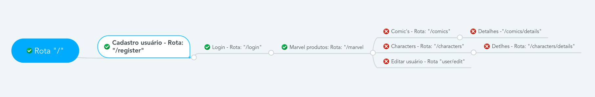

# vicmafe-stone

## Descrição do Projeto

Solução do proprietario do repositorio para 
construir aplicação para <a href="https://gist.github.com/jeansflores/5f4746ce1129e27da6f451069780ccf7">🔗 este</a> case proposto pela <a href="https://www.stone.com.br/">🔗 Stone</a>

 <a href="##objetivo">Objetivo</a> •
 <a href="##roadmap">Roadmap</a> • 
 <a href="##tecnologias">Status do Projeto</a> •
 <a href="##tecnologias">Features</a> •
 <a href="##tecnologias">Por onde começar</a> •
 <a href="##contribuicao">Demonstração da aplicação</a> • 

## Objetivo

Implementar uma aplicação client-side onde será encontrar todas as informações sobre as comics e characters da marvel;

 •

Implementar uma aplicação server-side que conterá funções de autenticação, gerenciamentos de usuários e de comics/characters favoritos.
 •

## Roadmap

<h1 align="center">
  
</h1>

## Status do Projeto

<h4 align="center"> 
	🚧  Em construção...  🚧
</h4>

### Features

- [x] Criação do dbs mysql
- [x] Criação pagina de cadastro usuario
- [x] Validação de Dados de cadastro
- [x] Endponit para cadastro usuario
- [x] Requisição do dbs com Axios
- [x] Integração com cors
- [x] Criação página Login
- [x] Endpoint para Login
- [x] Criando token com JWT
- [x] Recebendo dados do usuario
- [x] Salvando token no localStorage
- [x] Criação pagina marvel
- [ ] Fetch para endpoint marvel
- [ ] Criação botão sair
- [ ] Criação botão editar perfil
- [ ] Criação pagina character / comics
- [ ] Criação pagina detalhes character / comics
- [ ] Favoritar character e comics
- [ ] Endpoint para salvar favorito no dbs