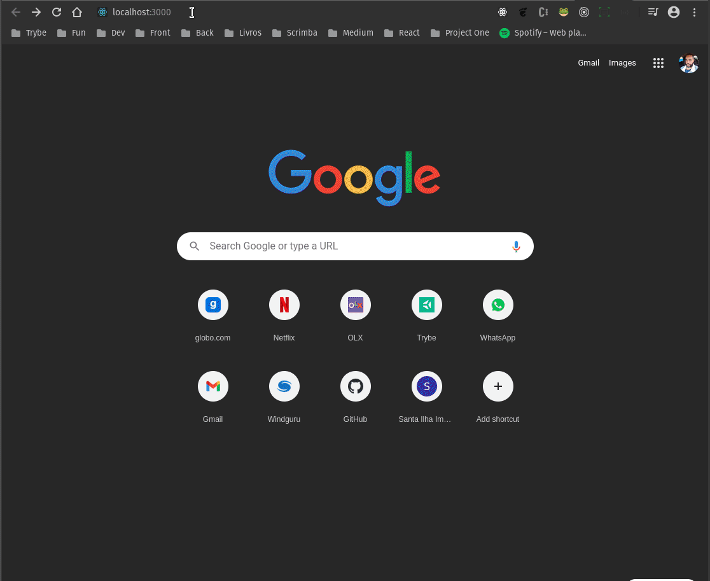

# Projeto app-stone

## Descrição do Projeto

Solução do proprietario deste repositorio para resolver <a href="https://gist.github.com/jeansflores/5f4746ce1129e27da6f451069780ccf7">🔗 este</a> case proposto pela <a href="https://www.stone.com.br/">🔗 Stone</a>

## Indice

 - <a href="##objetivo">Objetivo</a> 
 - <a href="##roadmap">Roadmap</a> 
 - <a href="##tecnologias">Status do Projeto</a> 
 - <a href="##tecnologias">Features</a> 
 - <a href="##tecnologias">Por onde começar</a> 
 - <a href="##contribuicao">Demonstração da aplicação</a>  

## Objetivo

•
Implementar uma aplicação client-side onde será encontrar todas as informações sobre as comics e characters da marvel;

•
Implementar uma aplicação server-side que conterá funções de autenticação, gerenciamentos de usuários e de comics/characters favoritos.

## Roadmap

  

## Status do Projeto

<h4 align="center"> 
	🚧  Em construção...  🚧
</h4>

### Features

- [x] Criação do dbs mysql
- [x] Criação pagina de cadastro usuario
- [x] Validação de Dados de cadastro
- [x] Endponit para cadastro usuario
- [x] Requisição do dbs com Axios
- [x] Integração com cors
- [x] Criação página Login
- [x] Endpoint para Login
- [x] Criando token com JWT
- [x] Recebendo dados do usuario
- [x] Salvando token no localStorage
- [x] Criação pagina marvel
- [ ] Fetch para endpoint marvel
- [ ] Criação botão sair
- [ ] Criação botão editar perfil
- [ ] Criação pagina character / comics
- [ ] Criação pagina detalhes character / comics
- [ ] Favoritar character e comics
- [ ] Endpoint para salvar favorito no dbs

## Por onde começar

•
Se você quer interagir com a aplicação funcionando, basta acessar<a href=https://vicmafe.github.io/case-stone.io//>🔗 aqui</a>;

•
Para Rodar localmente, siga os passos:
1 - abra o terminal; 
2 - digite: mkdir app-stone && cd app-stone; 
3 - git clone https://github.com/vicmafe/case-stone.io.git; 
4 - cd case-stone.io.; 
5 - É preciso estar com mysql intalado e no status ativo; 
6 - digite: npm install mysql2; 
7 - Entre no console do mysql: digite: mysql -u root -p; 
8 - Rode o script criação do dbs: digite: source script/sql; 
9 - No terminal na raiz do projeto digite: cd back-end; 
10 - Instale as dependencias: Digite: npm install; 
11 - Rode o back-end com o nodemon: Digite: npm start; 
11 - No terminal na raiz do projeto digite: cd front-end; 
10 - Instale as dependencias: Digite: npm install; 
11 - Inicie a aplicação: Digite: npm start; 

## Demonstração da aplicação

  

## Sobre o autor

<a href="https://www.linkedin.com/in/victor-mateus-ferreira/">
 
  
 <b>Vctor Mateus</b></a>🚀</a>

Feito com ❤️ por Victor Mateus 👋🏽 Entre em contato!
